# Explorando Arquiteturas de Jogo com um Roguelite

Recentemente, me inspirei na série de vídeos [**How to Make a Roguelite Game**](https://www.youtube.com/playlist?list=PLSHqi2dTiNGCncSOksACfJChpfPa6qz9w) e decidi usar esse projeto como laboratório para testar diferentes arquiteturas de código: **Spaghetti**, **ECS** e **SOAP**.

A ideia é entender, na prática, como cada abordagem lida com aspectos fundamentais do desenvolvimento de jogos, como **organização**, **escalabilidade** e **manutenção**. Neste primeiro post da série, inicio com a abordagem mais caótica e comum em protótipos: a **Arquitetura Spaghetti**.

---

## Parte 1 – O Começo do Espaguete

**⏱ Tempo de desenvolvimento:** 0 a 53 minutos
**🎥 Vídeo base:** [Part 1: ScriptableVariables and Bindings](https://www.youtube.com/watch?v=Yfp9aUxkfw4&index=1)

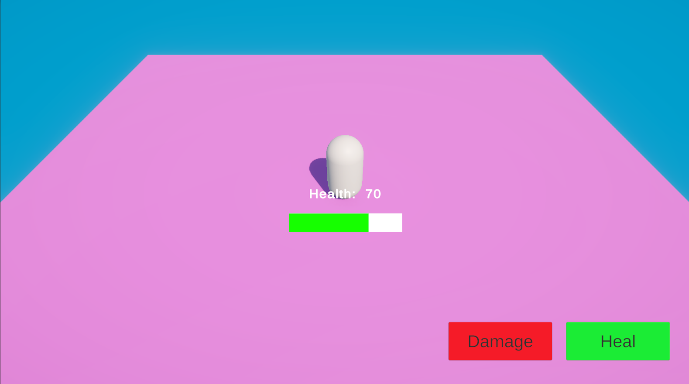

Logo no início, já nos deparamos com uma classe `Player` com **53 linhas** — e ela faz de tudo:

* Gerencia o input do jogador
* Controla a vida
* Armazena e atualiza os próprios dados

Além disso, há dois *binds* diretos:

* Um para atualizar o texto da vida
* Outro para atualizar a barra de vida

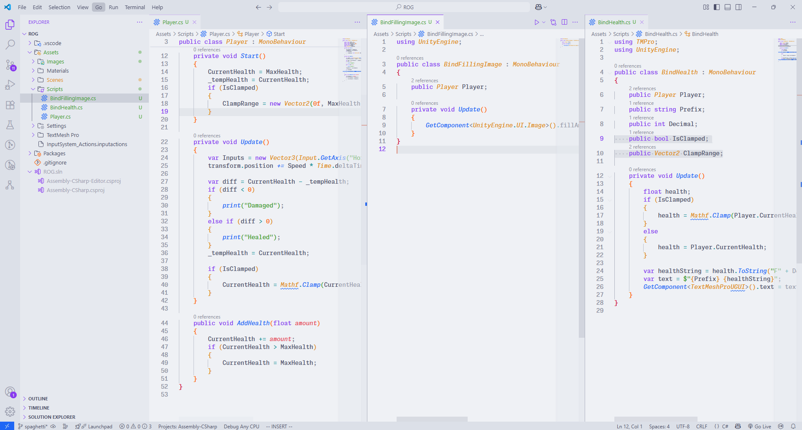

Esses elementos de UI (`Text` e `Health Bar`) estão fortemente **acoplados à lógica da classe `Player`**:

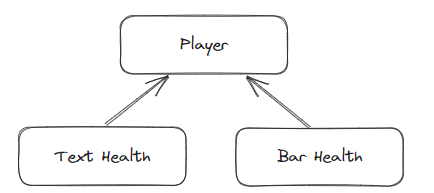

Neste estágio inicial, o acoplamento não impede o progresso. Tudo parece funcionar bem e rapidamente. Mas já começa a surgir um sinal amarelo: **o crescimento desordenado e a falta de separação de responsabilidades**.

---

### ✅ Pontos positivos:

* **Muito rápido para começar**
* **Implementação direta e simples**

### ❌ Pontos negativos:

* A classe `Player` já começa a ficar inflada
* Forte acoplamento entre lógica e UI
* Baixa modularidade, o que dificulta manutenção e testes

---

## Parte 2 – Crescimento Caótico

**⏱ Tempo de desenvolvimento:** 53 minutos a 1h39
**🎥 Vídeo base:** [Part 2: Scriptable Events, Variables and Bindings](https://www.youtube.com/watch?v=Xl5l3HqoQAk&index=2)

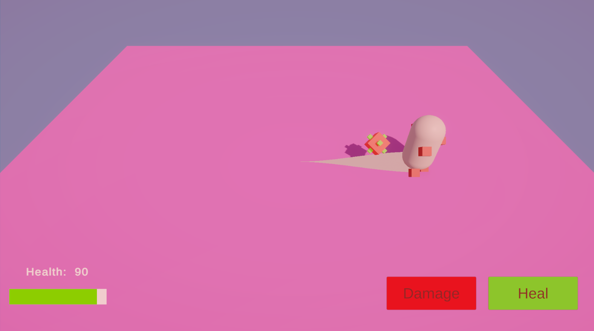

Nesta etapa, adicionamos efeitos visuais como partículas e vinhetas. A classe `Player`, antes com 53 linhas, agora está com **79 linhas**, acumulando ainda mais responsabilidades:

* Input
* Vida
* Dados
* E agora, também **efeitos visuais**

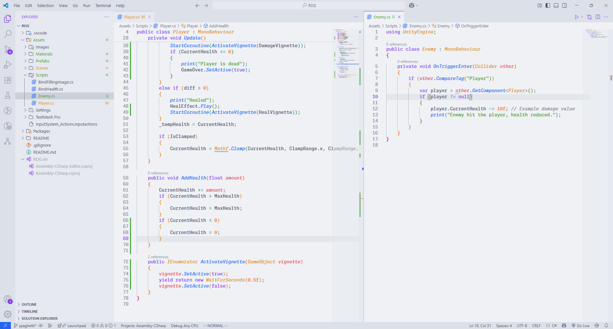

O número de dependências também cresceu: `Player` agora está conectado a **cinco elementos de UI**, e **dois também dependem diretamente do `Player`**.

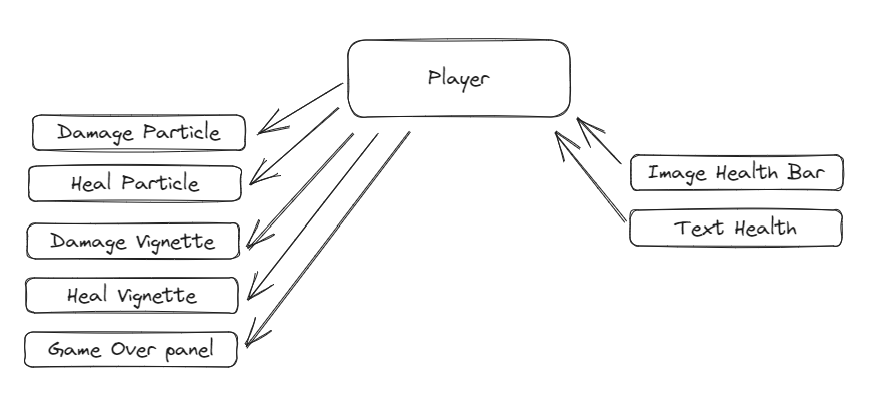

A sensação é clara: estamos entrando num território de **acoplamento perigoso**, mesmo que o projeto ainda esteja em um estágio simples.

---

### Conclusão da Parte 2

Apesar de manter um ritmo rápido, a arquitetura espaguete já demonstra suas limitações: o código está cada vez mais difícil de entender e modificar. A classe `Player` virou um verdadeiro **"Deus Objeto"**, responsável por muito mais do que deveria.

Essa abordagem ainda serve para protótipos e projetos pequenos, mas **acende o alerta vermelho** para projetos maiores ou colaborativos.

---

## Parte 3 – A Teia de Dependências

**⏱ Tempo de desenvolvimento:** 1h39 a 2h32
**🎥 Vídeo base:** [Part 3: Scriptable Lists](https://www.youtube.com/watch?v=ARyVWje6Nlk&index=3)

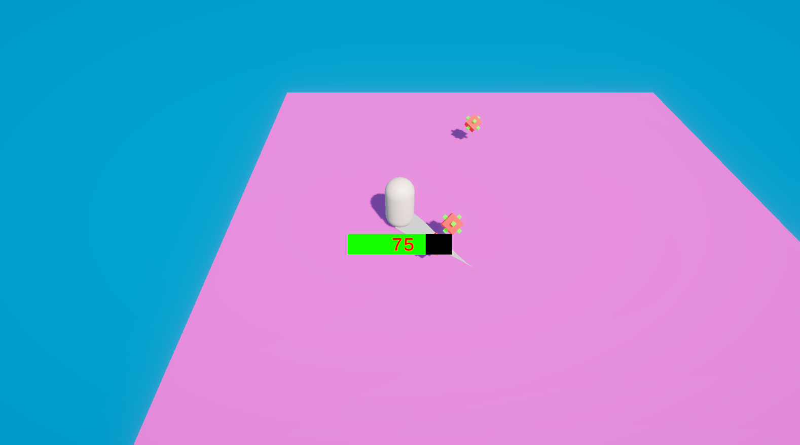

Nesta fase, adicionamos:

* Um sistema de *Spawner* de inimigos
* Efeitos visuais para os inimigos
* Remoção dos botões de debug

Curiosamente, o `Player` quase não mudou, mas o número de **relações entre os sistemas aumentou bastante**.

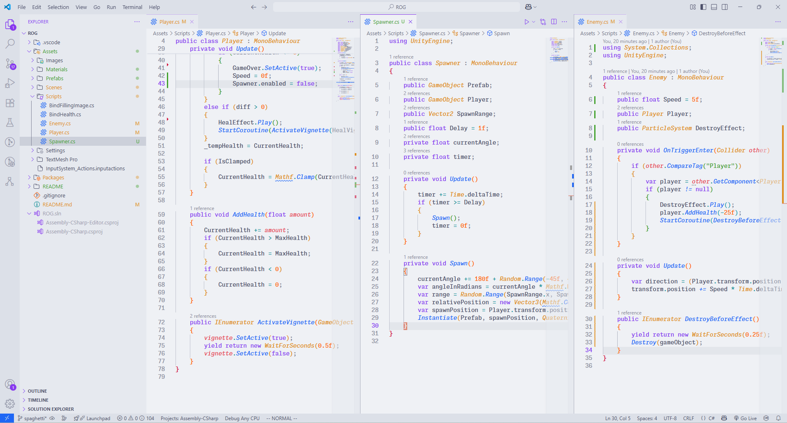

O que mais chama atenção aqui é a formação de um **nó de dependências**. Por exemplo:

* O `Player` depende do `Spawner`
* E o `Spawner`, por sua vez, também depende do `Player`

Essa **relação cíclica** é um indício claro de que o acoplamento saiu do controle.

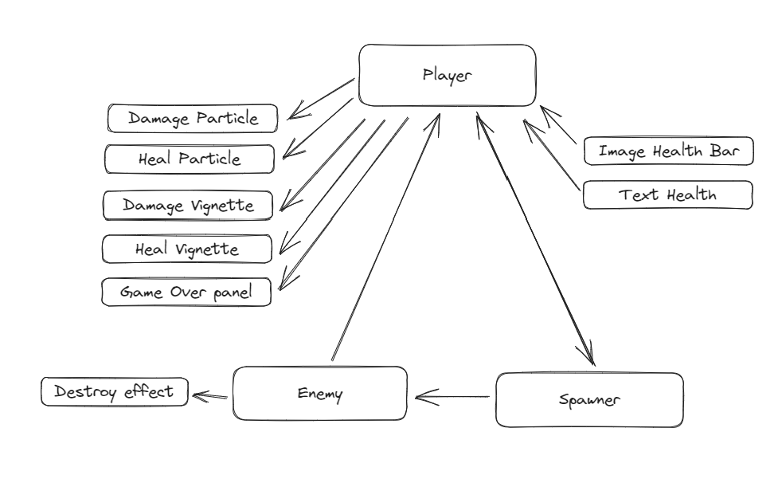

---

### Conclusão da Parte 3

Com cada nova funcionalidade, o sistema exige alterações em elementos já existentes — ou seja, **não é modular**. Em vez de crescer de forma organizada, o código se enrosca em dependências cruzadas.

A analogia com um prato de espaguete é perfeita: tudo está ligado a tudo, dificultando testes, refatorações e manutenção. Funciona para protótipos, mas **não escala**.

---

## Parte 4 – O Início do Cansaço

**⏱ Tempo de desenvolvimento:** 2h32 a 4h08
**🎥 Vídeo base:** [Part 4: Weapon and Pickups](https://www.youtube.com/watch?v=qvbSTnvsOtg&index=4)

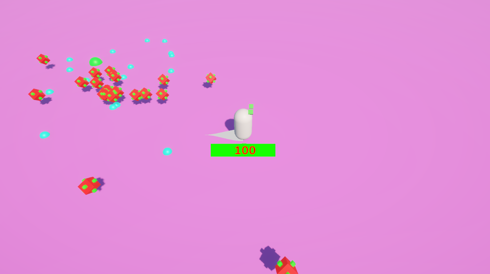

Nesta etapa, a complexidade começou a pesar. O que antes levava menos de uma hora para ser implementado, agora passa facilmente de **1h30** — não por conta da dificuldade técnica, mas pelo esforço necessário para **lidar com a bagunça acumulada**.

A cada nova funcionalidade, as classes existentes crescem ou são **duplicadas**. O projeto começa a perder fluidez e exigir cada vez mais atenção a detalhes desconexos.

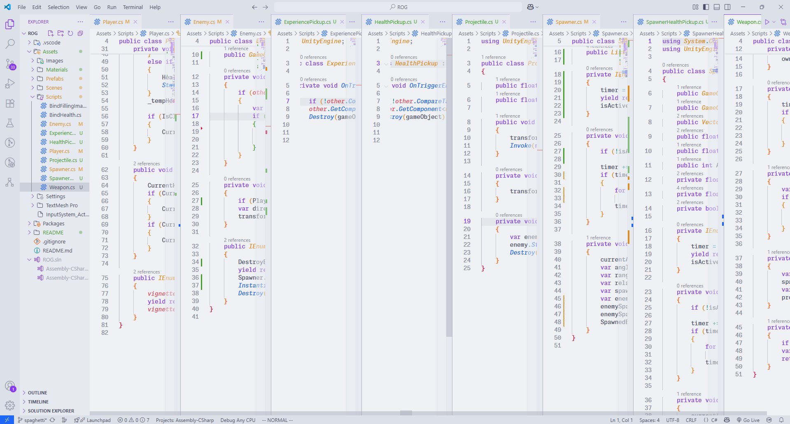

A imagem acima mostra como o número de scripts e a interdependência entre eles aumentaram. Alterar qualquer coisa exige navegar entre vários arquivos — e lembrar *quais arquivos precisam ser alterados* já se torna um desafio por si só.

---

### A complexidade escondida

As dependências estão mais caóticas do que nunca. Além de aumentarem, agora surgem **relações inesperadas** e até **inapropriadas**. Por exemplo:

* O `Enemy` passou a depender diretamente do **prefab do Experience Pickup**, algo que **quebra a lógica de separação de responsabilidades**.
* Começam a surgir **códigos duplicados** com pequenas variações — um sintoma clássico da falta de modularidade.

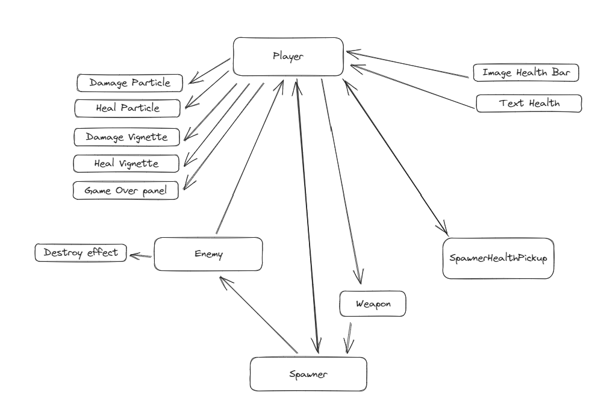

Além disso, algumas ações específicas — como o `Player` desativando **dois spawners** ao dar *Game Over* — mostram o quanto a lógica está entrelaçada, dificultando **reuso**, **testes** e **expansão**.

---

### Conclusão da Parte 4

Essa fase marca um ponto crítico no desenvolvimento com a arquitetura Spaghetti. **Adicionar novas funcionalidades se torna cansativo e desgastante**. Cada modificação exige lembrar de múltiplas partes do sistema, aumentando a chance de erros e tornando o processo frustrante.

A sensação é clara: **o projeto começa a lutar contra o próprio código**. A produtividade despenca, e o foco deixa de ser criar coisas novas para simplesmente “fazer tudo continuar funcionando”.

